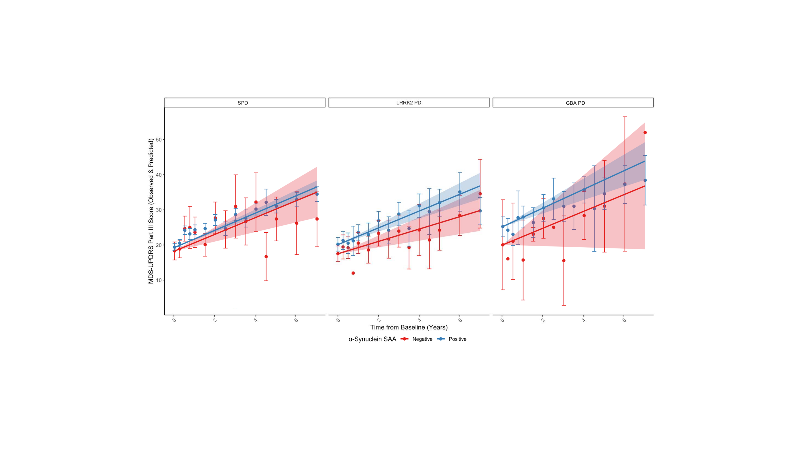

# Baseline α-synuclein seeding activity and disease progression in sporadic and genetic Parkinson's disease in the PPMI cohort

Schumacher JG, Zhang X, Macklin EA, Wang J, Bayati A, Dijkstra JM,
Watanabe H, Schwarzschild MA, Cortese M, Zhang X, Chen X.
*eBioMedicine.* 2025;119:105866.

**Published article:** [doi:10.1016/j.ebiom.2025.105866](https://doi.org/10.1016/j.ebiom.2025.105866)

---

## Overview

α-Synuclein seed amplification assays (SAAs) have shown remarkable
potential in diagnosing Parkinson's disease (PD). Using 7 years of
motor, non-motor, and cognitive assessments and 5 years of dopamine
transporter imaging along with baseline α-syn SAA results from 564 PPMI
participants (332 sporadic PD, 162 *LRRK2* PD, and 70 *GBA* PD), we
tested whether baseline α-syn SAA positivity and α-syn SAA kinetic
parameters are associated with disease progression.

We found no statistically significant or clinically meaningful
association between baseline α-syn seeding activity, α-syn SAA kinetic
parameters, and disease progression across sporadic, *LRRK2*, and *GBA*
PD. A trend toward faster motor decline in α-syn SAA positive *LRRK2*
PD was driven by R1441C/G + M1646T carriers (p=0.02); excluding them
eliminated the trend entirely.

## Key Findings

- **No association in sporadic PD.** SAA-positive (n=315) and
  SAA-negative (n=17) participants progressed at nearly identical rates
  (2.46 vs 2.39 MDS-UPDRS III pts/yr; β=0.07, p=0.90).
- **Trend in LRRK2 PD driven by R1441C/G + M1646T.** SAA-positive
  *LRRK2* PD trended faster than SAA-negative (2.39 vs 1.76 pts/yr;
  β=0.63, p=0.18), but excluding R1441C/G + M1646T carriers eliminated
  any difference (β=0.07, p=0.89).
- **R1441C/G + M1646T carriers showed significant divergence.**
  SAA-positive R1441C/G + M1646T carriers progressed markedly faster
  than SAA-negative (3.89 vs 0.31 pts/yr; β=3.58, p=0.02).
- **No association in GBA PD.** SAA-positive (n=66) vs SAA-negative
  (n=4): β=0.27, p=0.84.
- **No kinetic parameter associations.** T50, TTT, AUC, and Fmax
  quartiles showed no clinically meaningful differences in motor,
  non-motor, cognitive, or imaging outcomes.



*Figure 1. Change in MDS-UPDRS III (OFF-state) for sporadic (n=315 vs
17), LRRK2 (n=111 vs 51), and GBA PD (n=66 vs 4) by α-syn SAA status.
Adjusted for age, time since diagnosis, sex, race, ethnicity, education,
LEDD, and baseline score.*

## Data Sources

Source data are not redistributed. All inputs are available to approved
researchers through PPMI. Full variable descriptions are in
[`data/DATA_SOURCES.md`](data/DATA_SOURCES.md).

| Role | Dataset | Access |
|---|---|---|
| Clinical + imaging | PPMI (PD + Genetic Registry) | [ppmi-info.org](https://www.ppmi-info.org) |
| α-syn SAA | PPMI (24-h and 150-h Amprion protocols) | [ppmi-info.org](https://www.ppmi-info.org) |
| Genotyping | PPMI Genetics Core (WGS) | [ppmi-info.org](https://www.ppmi-info.org) |

## Repository Structure

```
saa_progression/
├── README.md
├── LICENSE
├── CITATION.cff
├── .gitignore
│
├── analysis/
│   ├── saa_progression_analysis.sas    Statistical analysis (SAS 9.4)
│   └── saa_progression_figures.Rmd     Figure generation (R 4.4.1)
│
├── figures/
│   ├── fig1_updrs3_by_saa_status.png        MDS-UPDRS III by SAA (Figure 1)
│   ├── sfig1_data_availability.png          Data availability histograms (Figure S1)
│   ├── sfig2_dag.png                        Directed acyclic graph (Figure S2)
│   ├── sfig3_updrs1_by_saa_status.png       MDS-UPDRS I by SAA (Figure S3)
│   ├── sfig4_moca_by_saa_status.png         MoCA by SAA (Figure S4)
│   ├── sfig5_dat_caudate_by_saa_status.png  DAT-SPECT caudate by SAA (Figure S5)
│   └── sfig6_dat_putamen_by_saa_status.png  DAT-SPECT putamen by SAA (Figure S6)
│
├── tables/
│   ├── table1_demographics.csv                    Demographics by SAA status
│   ├── table2_updrs3_by_saa.csv                   MDS-UPDRS III by SAA (sporadic/LRRK2/GBA)
│   ├── table3_updrs3_by_lrrk2_variant.csv         MDS-UPDRS III by LRRK2 variant and SAA
│   ├── stable1_lrrk2_variant_demographics.csv     LRRK2 variant demographics by SAA
│   ├── stable2_nonmotor_outcomes_by_saa.csv        MDS-UPDRS I, MoCA, DAT-SPECT by SAA
│   ├── stable3_t50_quartiles.csv                  Outcomes by T50 quartile
│   ├── stable4_ttt_quartiles.csv                  Outcomes by TTT quartile
│   ├── stable5_auc_quartiles.csv                  Outcomes by AUC quartile
│   └── stable6_fmax_quartiles.csv                 Outcomes by Fmax quartile
│
└── data/
    └── DATA_SOURCES.md
```

## Analysis Overview

**saa_progression_analysis.sas** — linear mixed-effects models
estimating yearly rate of change in MDS-UPDRS I and III, MoCA, and
DAT-SPECT SBR by α-syn SAA status and kinetic quartiles (T50, TTT, AUC,
Fmax), separately for sporadic, *LRRK2*, and *GBA* PD. Models include
participant-level random intercepts and slopes with unstructured
covariance and group-specific residual variance, adjusted for age, sex,
race, ethnicity, education, time since diagnosis, baseline score, and
LEDD.

**saa_progression_figures.Rmd** — R code for all main and supplemental
figures.

## Requirements

- SAS ≥ 9.4 (statistical analysis)
- R ≥ 4.4 with: dplyr, readxl, tidyr, ggplot2, patchwork, ggpubr,
  RColorBrewer (figures)

## Citation

```bibtex
@article{schumacher2025saa,
  title   = {Baseline α-synuclein seeding activity and disease
             progression in sporadic and genetic {Parkinson's} disease
             in the {PPMI} cohort},
  author  = {Schumacher, Jackson G. and Zhang, Xinyuan and Macklin,
             Eric A. and Wang, Jian and Bayati, Armin and Dijkstra,
             Johannes M. and Watanabe, Hirohisa and Schwarzschild,
             Michael A. and Cortese, Marianna and Zhang, Xuehong
             and Chen, Xiqun},
  journal = {eBioMedicine},
  volume  = {119},
  pages   = {105866},
  year    = {2025},
  doi     = {10.1016/j.ebiom.2025.105866}
}
```

## Acknowledgements

This research was funded by Aligning Science Across Parkinson's grant
ASAP-237603 through the Michael J. Fox Foundation for Parkinson's
Research and by the National Institutes of Health through the National
Institute of Neurological Disorders and Stroke grants R01NS102735 and
5R01NS126260.

Data used in the preparation of this article were obtained from the
Parkinson's Progression Markers Initiative (PPMI) database
([ppmi-info.org/data](https://www.ppmi-info.org/data)). PPMI is a
public–private partnership funded by the Michael J. Fox Foundation for
Parkinson's Research and funding partners, including 4D Pharma, AbbVie,
AcureX, Allergan, Amathus Therapeutics, Aligning Science Across
Parkinson's, AskBio, Avid Radiopharmaceuticals, BIAL, BioArctic, Biogen,
Biohaven, BioLegend, BlueRock Therapeutics, Bristol-Myers Squibb, Calico
Labs, Capsida Biotherapeutics, Celgene, Cerevel Therapeutics, Coave
Therapeutics, DaCapo Brainscience, Denali, Edmond J. Safra Foundation,
Eli Lilly, Gain Therapeutics, GE HealthCare, Genentech, GSK, Golub
Capital, Handl Therapeutics, Insitro, Jazz Pharmaceuticals, Johnson &
Johnson Innovative Medicine, Lundbeck, Merck, Meso Scale Discovery,
Mission Therapeutics, Neurocrine Biosciences, Neuron23, Neuropore,
Pfizer, Piramal, Prevail Therapeutics, Roche, Sanofi, Servier, Sun
Pharma Advanced Research Company, Takeda, Teva, UCB, Vanqua Bio, Verily,
Voyager Therapeutics, the Weston Family Foundation and Yumanity
Therapeutics.

## License

Apache License 2.0 — see [`LICENSE`](LICENSE).

## Contact

Jackson G. Schumacher — [jgschumacher@mgh.harvard.edu](mailto:jgschumacher@mgh.harvard.edu)
